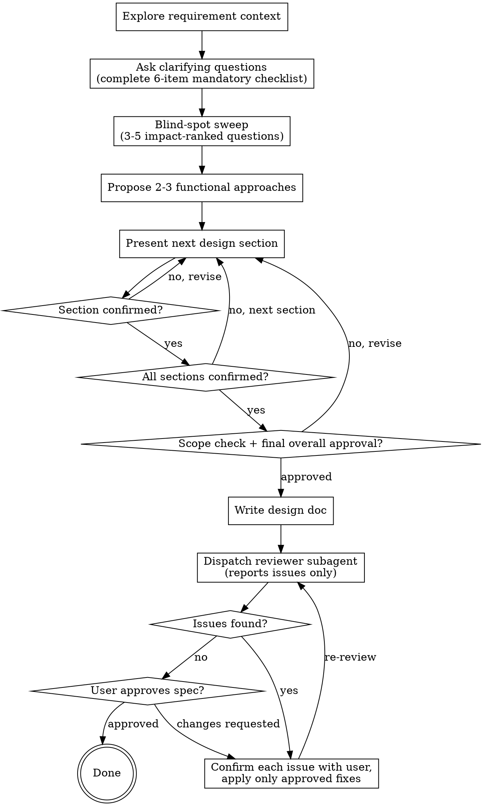

# Brainstorming Ideas Into Designs

Help turn ideas into a clear, reviewed design/spec document through natural collaborative dialogue.

Start by understanding the current project context, then ask questions one at a time to refine the idea. Once you understand what you're building, present the design and get user approval.

<HARD-GATE>
Do NOT invoke implementation skills, write code, scaffold projects, create implementation plans, or take implementation actions. This skill ends only after the design/spec document has been written, reviewed, and explicitly approved by the user. This applies to EVERY project regardless of perceived simplicity.
</HARD-GATE>

<SCOPE-CONSTRAINT>
Focus exclusively on **functional requirements** — what the system does, what features it provides, and how users interact with it. Do NOT explore non-functional requirements (performance, scalability, security hardening, deployment strategy, infrastructure) unless the user explicitly raises them. The output of this skill is a specification document that defines behavior, not a system design document.
</SCOPE-CONSTRAINT>

## Anti-Pattern: "This Is Too Simple To Need A Design"

Every project goes through this process. Adding a single field, changing a piece of copy, flipping a Status default — all of them. "Simple" requirements are where unexamined assumptions cause the most wasted work. The design can be short (a few sentences for truly simple projects), but you MUST present it and get approval.

## Wireframe Gap-Analysis Mode

**Trigger (auto-detect):** the user provides BOTH an existing requirement/spec document (MD) AND a Wireframe (HTML) in the conversation. When both are present, enter this mode automatically and announce it before doing anything else. Deliver the announcement in Traditional Chinese (per the Language & Communication Rules) and it must state: both a spec document and a Wireframe were detected; this mode treats the Wireframe as the authority, compares the spec against it to find gaps, and confirms each gap with the user before updating the spec; invite the user to say so if this is not the intended flow.

If the user corrects the intent, exit this mode and follow the standard flow instead.

**Authority rule:** the Wireframe reflects the final confirmed screen design and is the primary basis. The spec document is a draft that may be incomplete. The deliverable is an engineer-facing requirement document, not a technical design document. Wireframe sample data can still be wrong (e.g. a row showing a state the spec forbids) — treat sample-data inconsistencies as gaps to confirm with the user, never as automatic authority.

**Multiple specs, one Wireframe:** a single Wireframe may cover more than one spec document (e.g. one BO prototype containing both a template-management page and an order-management page). In that case: announce the screen-to-spec mapping up front before building the gap list; group the gap list per spec document; run ONE shared gap-confirmation flow (still one question at a time); and dispatch a separate reviewer subagent per spec document, passing the sibling spec(s) as companion context so cross-document contradictions are caught. Each spec gets its own `<feature-name>` output folder; the shared Wireframe copy lives in the folder of the feature whose name matches the Wireframe's title (confirm with the user if unclear), and the other spec folders reference it by relative path.

**Process (replaces checklist items 2–6 of the standard flow):**

1. Read both files completely before asking anything.

   **Wireframe reading procedure (HTML):** if the HTML cannot be meaningfully read as text (JS-rendered/bundled export, base64 payloads), render it in a browser instead — `file:` protocol is typically blocked, so serve the folder over a local HTTP server and navigate to it. Capture the accessibility snapshot for structure, but NEVER trust the snapshot alone for stateful attributes: default values, toggle ON/OFF, selected radio/checkbox/tab states are invisible in it. Verify every such state by inspecting DOM classes/computed styles (e.g. which segment of an ON/OFF switch carries the active styling). Empty-state screens (e.g. "Add New XX" blank forms) are the authoritative source for default values — read them, not the sample-data screens.
2. Compare them and build a gap list. Gap categories:
   - Fields/components present in the Wireframe but missing from the spec
   - Feature descriptions in the spec that do not match the Wireframe
   - Screen logic visible in the Wireframe but not described in the spec (states, filters, pagination, empty states)
   - Spec content that contradicts the Wireframe
   - Field attributes visible in the Wireframe but absent from the spec (see the mandatory field-attribute check below)

   **Mandatory field-attribute check:** for EVERY field that appears in both documents, verify all four wireframe-visible attributes are reflected in the spec. A missing attribute is a gap — confirm it with the user before writing it into the spec:

   1. **Default value** — e.g. the Wireframe shows Type preselected as Leaderboard, but the spec only lists "Leaderboard or First-To-Reach (choose one)" without stating the default
   2. **Interaction / control type** — e.g. the Wireframe defines Type as a radio-button single choice, but the spec does not state the control behavior
   3. **Required / optional marking** — e.g. the Wireframe marks the field "* required", but the spec does not state it is required
   4. **Placeholder / format hint** — e.g. the Wireframe shows "e.g. Summer Top Wins", but the spec has no format guidance
3. Present the complete gap list as an overview first, then confirm each gap **one at a time** (one question per message). Never fill in unconfirmed content yourself. Whenever a gap is resolved as "the spec wins — the Wireframe is wrong or outdated", record it in the **Wireframe-fix ledger** (see step 7).
4. For every NEW field discovered through the comparison, the relevant Mandatory Pre-Writing Checklist items still apply (default values, optional fields, multi-option fields).
5. Do NOT propose 2-3 approaches in this mode — the screen design is already customer-confirmed; re-opening it violates the confirmed-requirements rule. If a gap can only be resolved by changing a confirmed requirement, raise it as `[CHANGE REQUEST]` and wait for approval.
6. After all gaps are confirmed, write the updated spec to `outputs/neutec-brainstorming-result/<feature-name>/<feature-name>.md`. **NEVER modify the user's original input files** (neither the spec MD nor the Wireframe HTML) — every file this skill changes lives under the feature output folder; the originals stay untouched wherever they are:
   - Bump the minor version in Metadata (e.g. v1.0 → v1.1) and update Last Updated
   - Append a Change Log row summarizing the wireframe-based completion
   - If the source spec has no Metadata/Change Log at all, bootstrap them without asking: original file's date = v1.0 (Change Log row "Initial release"), current update = v1.1, Status = Draft, Author = the user
   - If a spec file already exists at this path (a prior version of the same feature), overwrite it in place rather than creating a duplicate
7. Apply the Wireframe-fix ledger: copy the Wireframe HTML into the feature output folder, then apply every user-approved fix from the ledger directly to that copy, so the delivered spec and Wireframe are consistent with each other. Verify the edited copy still renders correctly (open it in a browser) before delivering. Present the ledger (each fix: which screen, what changed) together with the review-gate message. If a fix cannot be applied reliably (e.g. the HTML is a compiled/bundled export where structural edits risk breaking the page), stop and discuss with the user instead of delivering a broken copy.
8. Then continue with the standard flow: spec review subagent → user review gate. The terminal state is unchanged — the user's explicit approval.

## Checklist

You MUST create a task for each of these items and complete them in order:

1. **Explore requirement context** — review the user's request, existing docs, and relevant files if available; check `outputs/neutec-brainstorming-result/<feature-name>/` subfolders for existing specs of a similar feature type to use as comparison references
2. **Ask clarifying questions** — one at a time, understand purpose, constraints, and success criteria; complete the Mandatory Pre-Writing Checklist (all 6 items) before moving on
3. **Blind-spot sweep** — list the 3-5 unanswered questions most likely to change the final result, ranked by impact, and confirm each with the user one at a time; include topics a reference spec covers that this conversation has not discussed
4. **Propose 2-3 functional approaches** — with trade-offs and your recommendation
5. **Present design** — section by section with per-section confirmation (Feature Description presented screen by screen, in the order its numbered headings will carry), then a scope check and a final overall approval before writing the spec
6. **Write design doc** — save to `outputs/neutec-brainstorming-result/<feature-name>/<feature-name>.md`, following the team spec template
7. **Spec review (subagent)** — dispatch the reviewer subagent; it reports issues only. Confirm every issue with the user before changing anything
8. **User reviews written spec** — the flow ends only when the user explicitly approves the spec


## Process Flow



**The terminal state is the user's explicit approval of the reviewed spec.** Do NOT invoke frontend-design, mcp-builder, implementation planning, coding, scaffolding, or any other implementation skill.

## The Process

**Understanding the idea:**

- Review the user's request, available docs, and relevant files before asking detailed questions.
- Check `outputs/neutec-brainstorming-result/<feature-name>/` subfolders for existing specs of a similar feature type. A reference spec serves two purposes: it supplies the product's established terminology and structure, and it feeds the blind-spot sweep (topics the reference handles that this conversation has not discussed).
- Before asking detailed questions, assess scope: if the request describes multiple independent subsystems (e.g., "build a platform with chat, file storage, billing, and analytics"), flag this immediately. Don't spend questions refining details of a project that needs to be decomposed first.
- If the project is too large for a single spec, help the user decompose it into smaller specs: what are the independent pieces, how do they relate, and which spec should be written first? Then brainstorm the first spec through the normal design flow. Each sub-project gets its own standalone spec document.
- For appropriately-scoped projects, ask questions one at a time to refine the idea
- Prefer multiple choice questions when possible, but open-ended is fine too
- Only one question per message - if a topic needs more exploration, break it into multiple questions
- Focus on understanding: purpose, constraints, success criteria

**Mandatory Pre-Writing Checklist:**

Before leaving the clarifying-questions stage, verify ALL six items below and report a conclusion for each to the user — including items that are not applicable ("本需求無此類欄位，此項不適用"). Do NOT enter Present design until every item has an explicit conclusion:

1. **Default values** — every field with a default (e.g. Status ON/OFF, display limits) confirmed with the user
2. **Optional fields** — for every optional field (e.g. Remark), confirmed whether this document fills it in
3. **Multi-option fields** — for every field with multiple options (e.g. Type / Mode / Board Type), all options listed and the user has chosen
4. **Cross-system impact** — confirmed whether other modules or systems are affected, and the impact scope
5. **Target reader** — confirmed whether the document is for BA / PG / QA
6. **Remaining unclear requirements** — asked, or marked `[TO CONFIRM]` with the user's agreement

These questions still follow the one-question-per-message rule — do not batch all six into one message.

**Blind-spot sweep (after the checklist, before proposing approaches):**

The 6-item checklist catches known categories of gaps; this step catches gaps specific to the current requirement — the questions nobody thought to ask.

1. List the 3-5 unanswered questions whose answers are most likely to change the final spec, ranked by impact (highest first). They must be specific to this requirement, not restatements of checklist items. Example for a leaderboard feature: "If the same Player wins multiple large prizes in one period, does the board show one row or several?", "After a Player renames, do historical boards show the old or the new name?" — answers that directly change how System Rules are written.
2. If a similar existing spec was found during context exploration, compare it against the current conversation and add every topic the reference spec handles that has not been discussed yet (e.g. the existing Winnerboard spec has an Exception Handling entry for maintenance mode, but this conversation never touched maintenance behavior).
3. Present the ranked list as an overview first, then confirm each question with the user **one at a time** (the one-question-per-message rule applies). Items the user cannot answer now are marked `[TO CONFIRM]` with the user's agreement.

**Handling the user's answers:**

- If an answer is too vague to act on (unclear reference such as "跟上次那個一樣", contradicts earlier information, or answers a different question), ask a follow-up question — never interpret it yourself.
- If the user answers multiple topics in one message, restate your understanding of ALL of them and get the user's confirmation before treating any of them as settled.

**Exploring approaches:**

- Propose 2-3 different approaches with trade-offs
- Present options conversationally with your recommendation and reasoning
- Lead with your recommended option and explain why

**Presenting the design:**

- Once you believe you understand what you're building, present the design **one section at a time**; after each section, ask the user whether it looks right before moving to the next.
- Section structure is the team spec template plus supplementary sections: Purpose, Use Cases (Who / When / Why), Screen Location, Feature Description (Backend and Frontend described separately, "N/A" if none — in that heading order, per the heading convention below), System Rules (numbered table), Exception Handling (standalone section), Acceptance Criteria, plus User Flows, Edge Cases, and Out-of-Scope items as supplements. Each section's required format is defined under "Document Format" below.
- When presenting Feature Description, present it **screen by screen**, in the order the numbered headings will carry (see "Feature Description heading convention" below). Settling the screen decomposition here, with the user, is what makes the later numbering mechanical rather than an authoring decision made alone at writing time.
- After ALL sections are individually confirmed, run a **scope check**: is this still a single-spec-sized document, or does it cover multiple independent subsystems? If it is too large, report this to the user with a suggested decomposition (which specs, which one first) and let the user decide — never split or cut content unilaterally.
- Then present a complete summary of the confirmed design and ask for **final overall approval**. Only start writing the spec file after this final approval.
- Scale each section to its complexity: a few sentences if straightforward, up to 200-300 words if nuanced
- Be ready to go back and clarify if something doesn't make sense

**Design for clarity:**

- Break the feature into clear functional areas with explicit responsibilities.
- For each area, define what users can do, what inputs are required, what outputs or state changes happen, and what rules apply.
- Avoid implementation-level decomposition unless it is necessary to clarify user-visible behavior.

**Working in existing projects:**

- Review existing product behavior, docs, and relevant files before proposing changes.
- Follow the product's existing terminology and interaction patterns.
- Do not propose unrelated refactoring or implementation cleanup in the spec unless it directly affects user-visible behavior.

## After the Design

**Documentation:**

- Write the validated design/spec to `outputs/neutec-brainstorming-result/<feature-name>/<feature-name>.md`
  - `<feature-name>` defaults to the topic of the spec; confirm it with the user before creating the folder if it isn't obvious
  - Version history lives in the document's Change Log (Metadata Version field), not in the filename or folder name — there is no date in this path
  - If a spec file already exists at this path (a prior version of the same feature, including one reached via Wireframe Gap-Analysis Mode), overwrite it in place rather than creating a duplicate
  - NEVER modify the user's original input files — every file this skill changes is written under the feature output folder
  - User preferences for spec location override this default
- The document MUST carry the Metadata table, the Change Log, and all required sections listed in "Presenting the design" above, in the formats defined under "Document Format" below.
- Use clear, concise writing.
- Do not commit the design document to git unless the user explicitly asks.

**Document Format (mandatory):**

These formats are what make a spec usable by its readers without further explanation — PG assesses feasibility from System Rules and Exception Handling, QA converts Acceptance Criteria straight into test cases — and what downstream tooling (`neutec-spec-wireframe-merge`) reads structurally. Follow them exactly.

*Metadata* — a table at the top of the document, four fields, no more and no fewer:

| Field | Format |
|---|---|
| Version | `v<major>.<minor>` — exactly two components, never a third (`v1.0` / `v1.1` / `v2.0`, never `v1.0.1`). A first version is always `v1.0` |
| Author | The writer's name |
| Last Updated | `YYYY-MM-DD` |
| Status | `Draft` / `In Review` / `Confirmed` — exactly one of the three |

`Status` governs how the document may be edited afterwards, so it is never omitted:

| Status | Meaning | Modification rule |
|---|---|---|
| Draft | Still under discussion with the user | Edit directly |
| In Review | Delivered to PG/QA for review | Edits allowed; every change gets a Change Log entry |
| Confirmed | Requirements finalized | Any change requires `[CHANGE REQUEST]` with a reason and the user's approval before editing |

*Change Log* — a table appended to on every update, one row per released version:

| Version | Date | Author | Summary |
|---|---|---|---|
| v1.0 | YYYY-MM-DD | Name | Initial release |

*Version bump* — minor (`v1.0` → `v1.1`) for content additions or revisions: a new System Rule, an added AC, a corrected description, wording fixes. Major (`v1.0` → `v2.0`) only when the requirement's direction changes or the feature is redesigned.

*System Rules* — a numbered table. Use scenario blocks inside the Description cell for cases with several status combinations, rather than splitting one rule across rows:

| No. | Title | Description |
|---|---|---|
| 1 | Rule name | Details |

*Exception Handling* — its own top-level section, never folded into Feature Description, in this fixed five-column table:

| No. | Exception Scenario | Trigger Condition | System Behavior | Frontend Display |
|---|---|---|---|---|
| 1 | Game clicked during maintenance | Player clicks a game in Maintenance status | Block game entry | Show maintenance dialog |

*Acceptance Criteria* — never omitted from a spec document. Each AC is numbered and written as Given / When / Then:

```
**AC-1**
- Given: precondition (e.g. game 「麻將胡了」 status is Active)
- When: trigger action (e.g. Operator sets status to Inactive in BO and saves)
- Then: expected result (e.g. game no longer shown in the frontend lobby; players already in-game are unaffected)
```

Write each AC at a level of detail QA can convert directly into a test case without consulting other sections. The one exception to "never omitted" is a Jira ticket (e.g. a User Story), whose General fields section does not require AC.

**Feature Description heading convention (mandatory):**

Chapter 4 "Feature Description" carries exactly two side subsections — `### 4.2 Backend` and `### 4.3 Frontend` — optionally preceded by `### 4.1` for a shared type/concept table the whole chapter refers to. Every screen or functional area below the two side subsections is its own numbered `####` heading:

```
## 4. Feature Description
### 4.1 <shared type/concept table, if the feature needs one>
### 4.2 Backend
#### 4.2.1 <screen or functional area name>
#### 4.2.2 <screen or functional area name>
### 4.3 Frontend
#### 4.3.1 <screen or functional area name>
#### 4.3.2 <screen or functional area name>
```

Rules:

- **One numbered `####` heading per screen or functional area.** A screen documented as a paragraph under a shared heading, or several screens merged under one heading, both violate this.
- **Number sequentially within each side**, in the order a user encounters the screens. Backend headings are always `4.2.N`, frontend always `4.3.N` — the two sides never share a sequence.
- **Write "N/A" under `### 4.2 Backend` or `### 4.3 Frontend`** when that side has no behavior, rather than omitting the heading.
- **Avoid unnumbered `#####` sub-headings where a numbered `####` heading would do.** They are legitimate only when one screen's field table genuinely splits by a variant the reader must choose between (e.g. a board type with two different reward tables). When you do use one, its title must be unique document-wide — a repeated title such as `##### 設定欄位` under two different screens cannot be addressed unambiguously downstream.
- **Field definitions belong in a two-column `| 欄位 | 說明 |` table** directly under their screen's heading. Fold "required" and "default value" wording into the 說明 cell rather than adding extra columns — downstream tooling reads the last cell of each row as that field's description, so a third or fourth column silently becomes the description.

This convention is not cosmetic. `neutec-spec-wireframe-merge` locates each screen's spec content by these headings, and builds one guide tab per screen from them; a spec that does not follow it either produces tabs carrying other screens' content or cannot be merged without hand-written per-document configuration.

**Spec Review (subagent):**

After writing the spec document, dispatch a reviewer subagent using the template in `references/spec-document-reviewer-prompt.md` (in this skill's directory). The reviewer **reports issues only — it never edits the document**.

Handle the review result as follows:

1. **No issues** → proceed to the User Review Gate.
2. **Issues found** → report the full issue list to the user, then confirm each item **one at a time** before changing anything:
   - **Ambiguity** (a requirement readable in two ways, including pure wording issues): always ask the user which reading is correct — never pick one yourself.
   - **TBD / TODO / incomplete content**: never fill it in yourself. Ask the user; if the user cannot answer now, keep the item in the document marked `[TO CONFIRM]`.
   - **Issues touching requirements the user already confirmed**: raise as `[CHANGE REQUEST]` with a reason and wait for approval before changing anything.
   - **Scope issues**: report with a suggested decomposition; the user decides.
3. Apply ONLY the fixes the user approved, then re-dispatch the reviewer subagent. Repeat until the review comes back with no issues. Re-review is mandatory after EVERY fix round with no exceptions — even a single-line wording fix requires a fresh reviewer pass before the flow can proceed to the User Review Gate; the loop ends only when a round returns zero issues.

Review-fix rounds do NOT bump the document version: all fixes applied before the user's final approval belong to the same version being prepared (e.g. everything folds into the one v1.1 entry), summarized in that version's single Change Log row. Versions bump only between user-approved releases, per the version bump rule under "Document Format".

`[TO CONFIRM]` and `[ASSUMPTION]` markers are legitimate content, not defects — never remove or rewrite them without the user's instruction.

**User Review Gate:**

After the spec review passes, ask the user to review the written spec:

> 「Spec 已寫入 `<path>`，其中尚有 N 個 `[TO CONFIRM]` 待確認項目（無則寫「無待確認項目」）。請 review 後告訴我是否需要調整。」

The same message MUST also include an **assumption memo**, delivered in Traditional Chinese: a list of every judgment made without the user's explicit confirmation while writing the spec — wording choices, structures or copy reused from other specs, interpretations of ambiguous answers — including judgments already written into the document, not only the `[ASSUMPTION]`-marked items. Each entry states what was decided and on what basis (e.g. 「Exception Handling 第 2 條的維護中彈窗文案，沿用既有 game-status-update 規格的文案，未經確認」). If there are none, state 「本次無自行判斷事項」.

Wait for the user's response. If they request changes, confirm each change with the user, apply it, and re-run the spec review. **The flow ends only when the user explicitly states the spec needs no further changes. A reply that requests changes is not approval.**


## [TO CONFIRM] Discipline

A `[TO CONFIRM]` marker may be written into a document ONLY after the user has been asked that specific question and explicitly chose to defer it. Unilaterally judging a gap as "unanswerable" (e.g. "the Wireframe doesn't show this", "this is a business decision") and marking it without asking is a process violation. This applies at every stage — gap confirmation, blind-spot sweep, review-issue handling, and gaps newly discovered during later review rounds.

- Ask each open detail as its own question (one question per message), and include a "cannot answer now — leave as `[TO CONFIRM]`" option alongside the substantive options.
- Bundled consent does not count: an option like "details not yet defined will be marked `[TO CONFIRM]`" inside a broader question is NOT consent for any specific marker. Each unresolved detail still gets its own question before its marker is written.
- If the user answers, write the answer into the document — no marker.
- By the User Review Gate, every remaining `[TO CONFIRM]` must be one the user personally deferred; report them as such in the gate message.

## Language & Communication Rules

- **Traditional Chinese required** — All dialogue, clarifying questions, design confirmations, and the final spec document MUST be written in Traditional Chinese (繁體中文). Do not use Simplified Chinese or switch to English unless the user explicitly requests it.
- **No uncertain language in specs** — The spec document MUST NOT contain hedging or uncertain expressions, in English ("should", "seems like", "probably", "might", "approximately") or in Chinese (「應該」、「可能」、「大概」、「似乎」、「原則上」、「基本上」). If information is missing or unclear, ask the user a direct clarifying question before writing — do not make assumptions or leave guesses in the document. Use `[TO CONFIRM]` / `[ASSUMPTION]` markers instead of vague phrasing.
- **No technical implementation questions** — Do not ask the user about technical choices such as programming languages, frameworks, databases, infrastructure, or deployment methods. Focus exclusively on what the system does and how users interact with it.

## Key Principles

- **One question at a time** - Don't overwhelm with multiple questions
- **Multiple choice preferred** - Easier to answer than open-ended when possible
- **YAGNI ruthlessly** - Remove unnecessary features from all designs
- **Explore alternatives** - Always propose 2-3 approaches before settling
- **Incremental validation** - Confirm each design section, get final overall approval before writing the spec, and end the flow only on the user's explicit approval of the written spec.
- **Be flexible** - Go back and clarify when something doesn't make sense

## Visual Companion

A browser-based companion for showing mockups, diagrams, and visual options during brainstorming. Available as a tool — not a mode. Accepting the companion means it's available for questions that benefit from visual treatment; it does NOT mean every question goes through the browser.

**Offering the companion:** When you anticipate that upcoming questions will involve visual content (mockups, layouts, diagrams), offer it once for consent:
> 「接下來要討論的內容，有些用畫面呈現會比文字說明更容易理解。我可以在瀏覽器裡即時做 mockup、流程圖、方案比較等視覺化內容給你看。這個功能還在初期階段，且會消耗較多 token。要試試看嗎？（需要開啟一個本機網址）」

**This offer MUST be its own message.** Do not combine it with clarifying questions, context summaries, or any other content. The message should contain ONLY the offer above and nothing else. Wait for the user's response before continuing. If they decline, proceed with text-only brainstorming.

**Per-question decision:** Even after the user accepts, decide FOR EACH QUESTION whether to use the browser or the terminal. The test: **would the user understand this better by seeing it than reading it?**

- **Use the browser** for content that IS visual — mockups, wireframes, layout comparisons, user-flow or state diagrams, side-by-side visual designs
- **Use the terminal** for content that is text — requirements questions, conceptual choices, tradeoff lists, A/B/C/D text options, scope decisions

A question about a UI topic is not automatically a visual question. "What does personality mean in this context?" is a conceptual question — use the terminal. "Which wizard layout works better?" is a visual question — use the browser.

If they agree to the companion, read the detailed guide before proceeding:
`references/visual-companion.md` (in this skill's directory)

## Changelog Maintenance

This skill folder contains a `CHANGELOG.md` file, formatted per [Keep a Changelog](https://keepachangelog.com/): semantic version headers (`## [X.Y.Z] - YYYY-MM-DD`, newest on top) followed by a `**Author:** <name>` line, then entries grouped under `### Added` / `### Changed` / `### Removed` / `### Fixed` / `### Known Limitations` as applicable. Written entirely in English, consistent with the rest of this skill file. Whenever SKILL.md (or any other file in this skill folder) is modified, append a new version entry to `CHANGELOG.md` summarizing what changed and naming the author, immediately as part of the same edit — bump the version (patch for fixes/wording, minor for feature additions or workflow changes, major for a full redesign) and do not wait to be asked or skip this step. If the author is unclear (e.g. an automated or unattributed change), ask rather than guessing.
